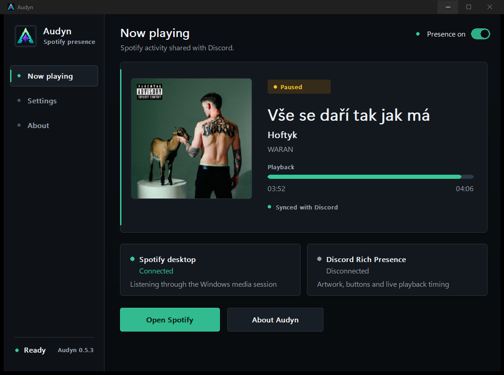
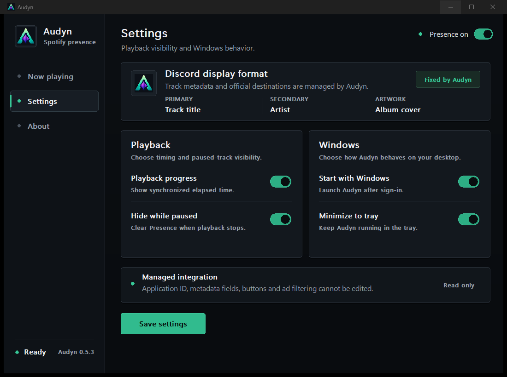
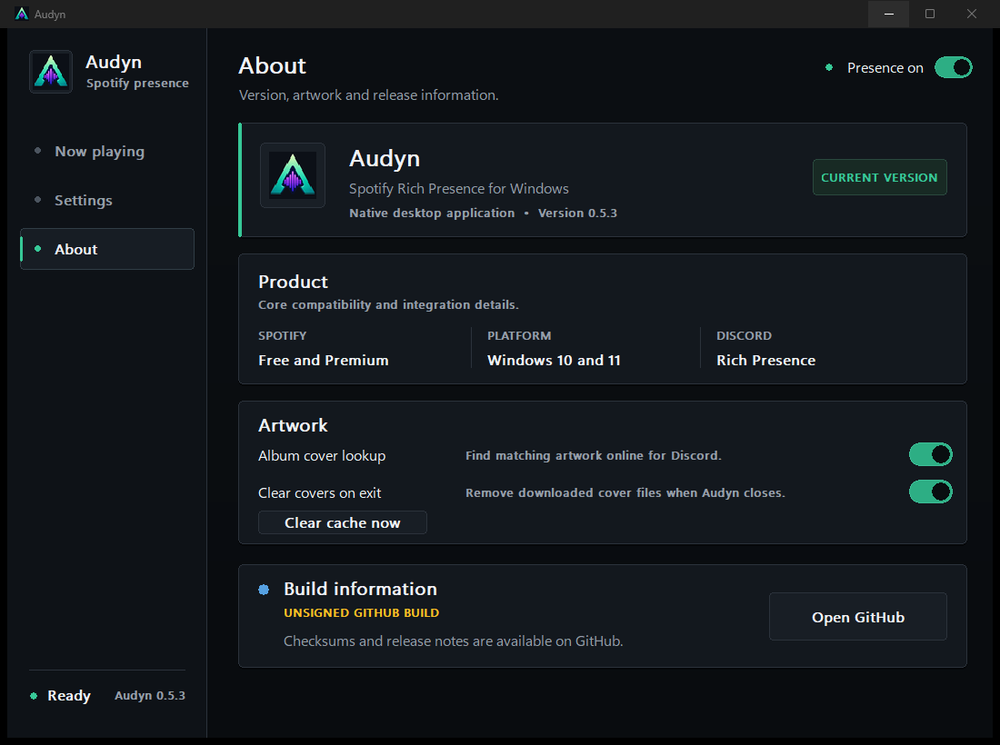
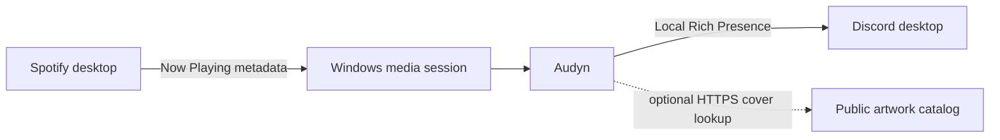

<p align="center">
  
</p>

<h1 align="center">Audyn</h1>

<p align="center">
  <strong>Spotify Rich Presence for Windows, without account linking.</strong><br>
  Share the track you are listening to on Discord with album artwork, accurate timing and useful buttons.
</p>

<p align="center">
  
  
  
  
  
</p>

<p align="center">
  <a href="https://github.com/rookeudev/AUDYN/releases/latest"><strong>Download for Windows</strong></a>
  &nbsp;·&nbsp;
  <a href="#quick-start">Quick start</a>
  &nbsp;·&nbsp;
  <a href="#privacy-by-design">Privacy</a>
  &nbsp;·&nbsp;
  <a href="#troubleshooting">Troubleshooting</a>
  &nbsp;·&nbsp;
  <a href="LICENSE.md">License</a>
</p>

---

<p align="center">
  
</p>

Audyn is a lightweight native Windows companion for the Spotify and Discord desktop applications. It reads the media information Spotify already exposes to Windows and publishes a polished activity through Discord's local Rich Presence connection.

It works with **Spotify Free and Spotify Premium**, requires no browser login, and keeps running quietly without a terminal window.

## What's new in 0.5.3

- Completely redesigned native interface with a cleaner, more professional visual system.
- Reorganized Settings with dedicated **Playback** and **Windows** sections.
- Fixed Discord display format: track title, artist and album artwork cannot be replaced by custom text.
- Locked official Application ID, GitHub destination, Spotify-track button and advertisement filtering.
- Removed legacy Presence templates and editable metadata keys from `settings.ini`.
- Added smoother, restrained hover feedback for interactive controls.
- Improved Dashboard readability and simplified About and build information.
- Added fresh screenshots captured directly from the 0.5.3 Windows build.

## Interface

### Now Playing

The Dashboard keeps the current track, artist, album, artwork and playback position in one clear view. Spotify and Discord connection states are visible without opening another page.

### Professional Settings

Settings contain only real application controls. Track title, artist, album artwork and official integration destinations are displayed as read-only build behavior.

<p align="center">
  
</p>

### About and Artwork

The About page contains version information, compatibility details, artwork controls and the exact signing status of the running executable.

<p align="center">
  
</p>

## Highlights

| Feature | What it does |
|---|---|
| Discord Rich Presence | Shows the current track and artist with synchronized playback time. |
| Album artwork | Uses the local cover or an optional matched public album image. |
| Spotify Free support | Playback detection does not require a Premium subscription. |
| Fixed official buttons | Opens the Audyn GitHub repository and the current track on Spotify. |
| Accurate seeking | Restarting or seeking within the same track resynchronizes the Discord timer. |
| Advertisement filtering | Clears Presence for detected ads, locked advertising sessions and Spotify items up to 90 seconds. |
| Background operation | Can minimize to the system tray and start automatically with Windows. |
| Native Windows build | Uses C++20 without Electron, an installer, administrator access or a console window. |

## Quick start

1. Download `Audyn-0.5.3-win64.zip` from the [latest release](https://github.com/rookeudev/AUDYN/releases/latest).
2. Verify the checksum and extract the ZIP to a folder you trust.
3. Open the Spotify and Discord desktop applications.
4. Run `Audyn.exe` and start a song in Spotify.
5. Keep the top-right switch set to **Presence on**.

Audyn creates a per-user Start Menu shortcut after the first launch. Keep the extracted application folder in place so the shortcut continues to point to `Audyn.exe`.

No installation, administrator rights, Spotify Premium subscription or account authorization page is required.

## How it works



Audyn does not use the Spotify Web API to detect playback. Instead, it reads the local Windows media session published by Spotify. The current display is then sent directly to the locally running Discord desktop client.

Optional album-cover lookup searches Deezer's public catalog using the current artist and track title. Only approved HTTPS artwork hosts are accepted. If a confident match is unavailable, Audyn uses its own artwork.

## Settings and fixed identity

Users can configure:

- synchronized playback progress;
- whether Presence is hidden while paused;
- Start with Windows;
- minimize-to-tray behavior;
- optional online album-cover lookup;
- automatic artwork-cache cleanup.

The official build keeps these values fixed:

- primary line: **track title**;
- secondary line: **artist**;
- large image: **album artwork when available**;
- Discord Application ID;
- GitHub button destination;
- current-track Spotify button behavior;
- advertisement filtering rules.

These fields cannot be rewritten through the interface or legacy `settings.ini` keys.

## Privacy by design

Audyn is designed to provide Rich Presence without creating an account bridge between Spotify and Discord:

- no Spotify or Discord password is requested;
- no OAuth access token or refresh token is received or stored;
- no Audyn account is created;
- no Audyn-operated account-linking backend is used;
- track, artist and album names are excluded from operational logs;
- no analytics SDK, advertising SDK or user-profiling service is included;
- downloaded covers can be cleared immediately or automatically on exit.

Read the complete [Privacy Notice](PRIVACY.md) and [Security Policy](SECURITY.md) for the exact data flow, limits and controls.

### Why Audyn avoids connected accounts

OAuth account linking is a standard authorization method and is not automatically unsafe. However, approving a third-party integration gives that application an access token with the permissions selected during authorization. Depending on the granted scopes, this can expose profile data, playlists, saved content or information about Discord servers.

Compared with software that never receives account authorization, a connected integration adds another credential, storage location and service that must remain protected. If its token, redirect flow, storage or backend is compromised, an unauthorized person may be able to use the permissions previously granted to that integration. This can make access to personal account data easier than when no third-party account permission exists.

Audyn avoids that additional access path. It reads only the current local media session and communicates with Discord through its local desktop RPC connection.

> [!NOTE]
> This does not mean every connected application is dangerous. It explains why Audyn requests no account access when local Rich Presence can work without it.

## Downloads and verification

Official files are published through [rookeudev/AUDYN Releases](https://github.com/rookeudev/AUDYN/releases). Each Windows archive contains:

```text
Audyn.exe
LICENSE.txt
README.txt
SHA256SUMS.txt
SIGNATURE-STATUS.txt
```

Verify the extracted executable in PowerShell:

```powershell
Get-FileHash .\Audyn.exe -Algorithm SHA256
Get-AuthenticodeSignature .\Audyn.exe
```

The SHA-256 value must match `SHA256SUMS.txt`. `SIGNATURE-STATUS.txt` states whether that exact executable has a trusted publisher signature.

## Requirements

- Windows 10 version 1809 or newer, or Windows 11;
- Spotify desktop app from Spotify or the Microsoft Store;
- Discord desktop app with activity sharing enabled.

The Spotify web player and Discord web client are not supported because they do not expose the local Windows interfaces Audyn uses.

## Troubleshooting

### Discord does not show the activity

- Confirm that both Spotify and Discord are desktop applications.
- Check that the Audyn switch says **Presence on**.
- Enable activity sharing under **Discord User Settings → Activity Privacy**.
- Start a normal music track rather than an advertisement.
- If Discord was opened after Audyn, restart Audyn once.

### The timer is incorrect after seeking

Audyn detects a seek or restart of the same track during the next media update, normally within two seconds. Active Presence is also refreshed periodically and reconnected after temporary Discord RPC failures.

### Album artwork is missing

Open **About** and enable **Album cover lookup**. Artwork matching is intentionally strict, so Audyn falls back to its own image when it cannot find a confident match.

### Windows shows a SmartScreen warning

Check `SIGNATURE-STATUS.txt`, compare the SHA-256 value and inspect the Authenticode result. A new or unsigned GitHub build may trigger SmartScreen while publisher reputation develops.

## Signing and Microsoft status

Audyn is prepared for Authenticode signing and a future Microsoft Store submission. A GitHub build is not described as Microsoft-certified unless that exact package has passed Microsoft Partner Center certification.

The running application displays its exact signature state under **About → Build information**. See [MICROSOFT-TRUST.md](MICROSOFT-TRUST.md) for the current status and owner checklist.

## Repository and license

This public repository contains product documentation, screenshots and compiled release artifacts. Private source code and build infrastructure are not included.

Audyn is proprietary software, not an open-source project. The [Audyn Proprietary Software License Agreement](LICENSE.md) prohibits false authorship claims, removal of attribution, unofficial redistribution, project impersonation, and attempts to derive or reuse private source code except where mandatory law provides a non-waivable exception.

Native binaries cannot be made impossible to analyze. Official release builds use compiler hardening, stripped symbols and controlled packaging, but users should rely on checksums and valid publisher signatures rather than claims of absolute source protection.

---

<p align="center">
  Audyn is an independent project and is not affiliated with, certified by or endorsed by Spotify, Discord, Deezer, Microsoft or GitHub.
</p>
