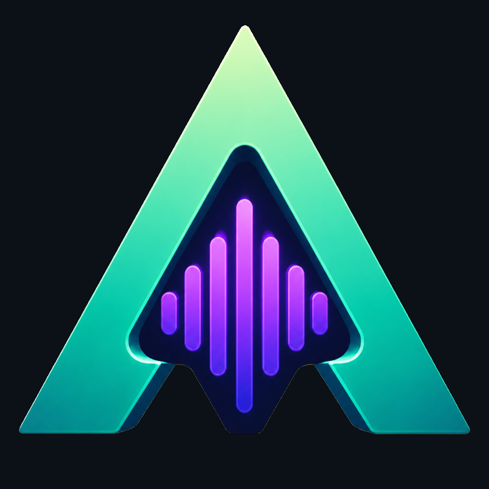
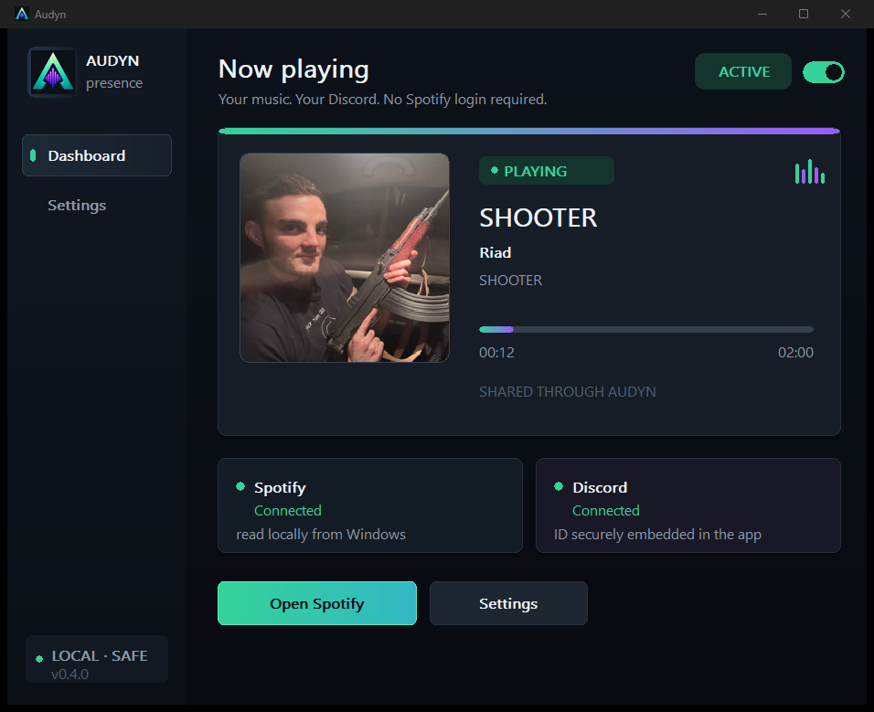
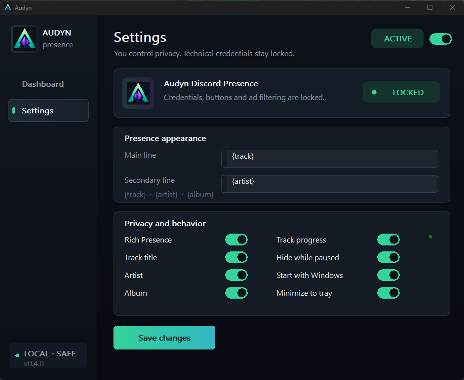

<p align="center">
  
</p>

<h1 align="center">Audyn</h1>

<p align="center">
  A lightweight Spotify Rich Presence companion for Windows.<br>
  <strong>No Spotify Premium. No Spotify login. No terminal window.</strong>
</p>

<p align="center">
  
  
  
  
</p>

<p align="center">
  <a href="../../releases/latest"><strong>Download the latest release</strong></a>
  ·
  <a href="#quick-start">Quick start</a>
  ·
  <a href="#privacy">Privacy</a>
</p>

---

Audyn reads the track playing in the Spotify desktop app and displays it as a polished Discord Rich Presence. It shows the track title, artist, playback time, album artwork, and the Audyn logo without requiring Spotify API credentials.

## Preview

<p align="center">
  
</p>

<details>
  <summary><strong>View the settings screen</strong></summary>
  <br>
  <p align="center">
    
  </p>
</details>

## Highlights

- Works with both Spotify Free and Spotify Premium.
- Requires no Spotify login, OAuth flow, Client ID, Client Secret, or browser authorization.
- Shows the track title, artist, album, artwork, and elapsed or remaining time on Discord.
- Resynchronizes the Discord timer after seeking or restarting the same track.
- Detects advertisements and clears Rich Presence before advertisement metadata is shared.
- Provides fixed GitHub and Spotify track buttons in the official build.
- Runs as a native C++ Windows application with no Electron runtime and no terminal window.
- Supports the system tray, start with Windows, and minimize to tray.
- Contains no Audyn analytics, account system, advertising, or remote backend.

## Quick start

1. Download the Audyn Windows ZIP from the [latest release](../../releases/latest).
2. Extract the ZIP and run `Audyn.exe`.
3. Start the Discord desktop app and make sure activity sharing is enabled.
4. Start the Spotify desktop app and play a track.
5. Leave the Presence switch in Audyn set to **ACTIVE**.

No installation or Spotify authorization is required. Audyn can be minimized to the notification area after it connects.

## What appears on Discord

```text
Track title
Artist
Playback time and progress
[ GitHub ] [ Open track on Spotify ]
```

The album cover is used as the large image. The locked Audyn application icon is displayed as the small overlay. The Spotify button is generated for the current track, while the GitHub button always opens the official [rookeudev/AUDYN](https://github.com/rookeudev/AUDYN) repository. Its destination is embedded into official builds and cannot be edited from the application settings.

## Settings

Audyn lets you control:

- whether Rich Presence is active;
- track title, artist, album, and progress visibility;
- the main and secondary Presence text formats;
- whether Presence is hidden while playback is paused;
- automatic startup with Windows;
- minimizing the application to the system tray.

Technical credentials, Discord Application ID, advertisement filtering, and official button destinations are not exposed as user-editable settings.

## How it works without Spotify Premium

Audyn reads the local media information published by the Spotify desktop app through Windows `GlobalSystemMediaTransportControlsSessionManager`. It does not use Spotify's Web API, so it does not need a Spotify developer application or a Premium account.

The detected activity is sent directly to the running Discord desktop client through local Discord RPC. For a publicly accessible cover image, Audyn anonymously searches Deezer's public catalog and accepts an image only when the title, artist, and approximate duration match.

## Privacy

Audyn has no telemetry and does not operate an Audyn server. During normal use it processes only:

- Spotify media metadata available locally through Windows;
- an anonymous album-art search containing the artist and track title;
- local Rich Presence messages sent to the Discord desktop client.

Advertisement metadata is rejected before an artwork lookup or Discord publication. Audyn never asks for a Spotify password, access token, or Discord token.

Local application files are stored here:

```text
%LOCALAPPDATA%\Audyn\settings.ini
%LOCALAPPDATA%\Audyn\audyn.log
%LOCALAPPDATA%\Audyn\artwork\
```

## Requirements

- Windows 10 version 1809 or newer, or Windows 11;
- the Spotify desktop app from Spotify or Microsoft Store;
- the Discord desktop app with activity sharing enabled.

The Spotify web player and Discord web client are not supported because they do not expose the local interfaces Audyn uses.

## Troubleshooting

### Discord does not show the activity

- Confirm that both Spotify and Discord are their desktop applications.
- Make sure the switch in Audyn says **ACTIVE**.
- Make sure Discord activity sharing is enabled.
- Start playing a track, then restart Audyn if Discord was opened later.

### The Discord timer is incorrect

Audyn detects seeking and same-track restarts on its next playback poll, normally within two seconds. It also refreshes an active Discord Presence periodically and retries automatically after a temporary Discord RPC failure.

### Album artwork is missing

Artwork matching is intentionally strict to prevent the wrong cover from being displayed. When no reliable public match is found, Audyn uses its application artwork instead.

### An advertisement starts playing

Audyn clears Discord Presence while an advertisement is detected. Advertisement information is not looked up or published.

## Downloads and integrity

Official Windows builds are published only on this repository's [Releases page](../../releases). Each release archive contains:

```text
Audyn.exe
README.txt
SHA256SUMS.txt
```

You can verify the downloaded executable from PowerShell after extracting the archive:

```powershell
Get-FileHash .\Audyn.exe -Algorithm SHA256
```

Compare the resulting hash with `SHA256SUMS.txt`. Release builds use link-time optimization, dead-code elimination, stack protection, stripped symbols, DEP/NX, ASLR, high-entropy VA, and the Windows GUI subsystem.

This is a binary distribution repository; source code and build infrastructure are not included. See [SECURITY.md](SECURITY.md) for the security and release model.

## Technologies

- [Windows system media transport controls](https://learn.microsoft.com/windows/uwp/audio-video-camera/system-media-transport-controls)
- [Discord local RPC](https://docs.discord.com/developers/topics/rpc)
- Native Windows UI and C++20

---

<p align="center">
  Audyn is an independent project and is not affiliated with Spotify, Discord, or Deezer.
</p>
