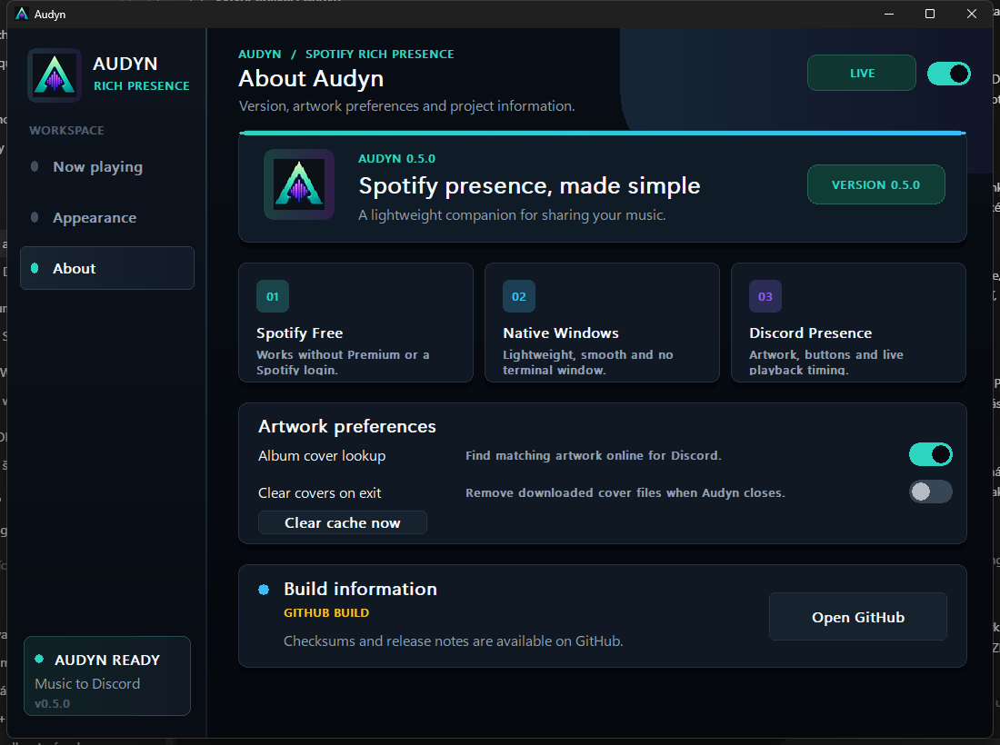
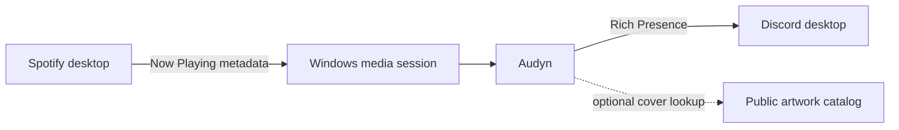

<p align="center">
  
</p>

<h1 align="center">Audyn</h1>

<p align="center">
  <strong>Beautiful Spotify Rich Presence for Windows.</strong><br>
  Share the track you love on Discord with artwork, live timing and useful buttons.
</p>

<p align="center">
  
  
  
  
  
</p>

<p align="center">
  <a href="../../releases/latest"><strong>Download Audyn for Windows</strong></a>
  ·
  <a href="#quick-start">Quick start</a>
  ·
  <a href="#troubleshooting">Troubleshooting</a>
</p>

---

Audyn is a lightweight Windows companion for Spotify and Discord. Start a song in the Spotify desktop app and Audyn turns it into a polished Discord activity—complete with the track name, artist, album cover and a synchronized playback timer.

It works with both **Spotify Free and Spotify Premium**, runs quietly in the system tray and never needs a terminal window.

## Preview

<p align="center">
  
</p>

<details>
  <summary><strong>Appearance controls</strong></summary>
  <br>
  <p align="center"></p>
</details>

<details>
  <summary><strong>About and artwork preferences</strong></summary>
  <br>
  <p align="center"></p>
</details>

## Highlights

- **Full Discord activity:** track, artist, album, playback state and live progress.
- **Spotify Free support:** no Premium subscription is required.
- **Album artwork:** matching public cover art appears as the large Presence image.
- **Useful buttons:** fixed links to the official Audyn GitHub repository and the current track on Spotify.
- **Accurate timing:** seeking or restarting the same track resynchronizes the Discord timer.
- **Advertisement filtering:** Audyn rejects localized ad metadata, locked advertising sessions and every Spotify item up to 90 seconds, then immediately clears Discord activity.
- **Personal appearance:** choose which fields are displayed and customize both Presence text lines.
- **Smooth native UI:** animated hover states, responsive controls and a modern dark design.
- **Background mode:** minimize to the Windows tray and optionally start with Windows.
- **Start Menu entry:** after the first launch, search for `Audyn` from the Windows Start menu.
- **Lightweight build:** native C++20, no Electron runtime and no console window.

## Quick start

1. Download `Audyn-0.5.2-win64.zip` from the [latest release](../../releases/latest).
2. Extract the ZIP to a folder you trust.
3. Open the Spotify and Discord desktop applications.
4. Run `Audyn.exe` once and play a song in Spotify.
5. Keep the switch in the top-right corner set to **LIVE**.

That is all. Audyn creates a per-user Start Menu shortcut automatically, so future launches can be found by searching for **Audyn** in Windows. Keep the extracted folder in place so the shortcut continues to point to `Audyn.exe`.

Audyn does not require installation, administrator rights, a Spotify Premium subscription or a browser login.

## How it works



Audyn reads the media information that Spotify already publishes to Windows and sends the selected display fields to the Discord desktop client. It does not use the Spotify Web API for playback detection, which is why Spotify Premium is unnecessary.

Album-cover lookup is optional. When enabled, Audyn searches the Deezer public catalog using the artist and track title. If a reliable match is not available, the Audyn artwork is used instead.

## Personalize your Presence

The **Appearance** page lets you choose whether Discord shows:

- track title;
- artist;
- album;
- playback progress;
- paused tracks.

You can also customize the main and secondary lines with `{track}`, `{artist}` and `{album}`. The Discord Application ID, GitHub destination, Spotify-track button behavior and advertisement filtering are part of the official build and cannot be edited in the app.

## Privacy and security

Security is designed into the background of Audyn without getting in the way of the music experience:

- no Spotify or Discord account is connected to Audyn;
- no OAuth token, password, client secret or user token is requested or stored;
- Discord Presence is sent to the locally running desktop client;
- track and artist names are excluded from diagnostic logs;
- online cover lookup can be disabled from **About**;
- downloaded artwork can be cleared immediately or automatically on exit;
- HTTPS responses, image downloads and Discord messages are size-limited and validated;
- release builds enable standard Windows process and compiler hardening.

## Why Audyn avoids connected accounts

Many Spotify and Discord integrations use OAuth to connect a user's accounts. OAuth is a standard authorization system and is not automatically unsafe, but approving a connection gives the third-party application an access token. The scopes approved by the user determine which account data the application can read or change. Depending on those scopes, this can include profile information, playlists, saved content, or the Discord servers a user belongs to. This behavior is documented by both [Spotify Authorization](https://developer.spotify.com/documentation/web-api/concepts/authorization) and [Discord OAuth2 and Permissions](https://docs.discord.com/developers/platform/oauth2-and-permissions).

Compared with an application that holds no account authorization, a connected integration creates another credential and another service that must be trusted and protected. If its token, storage, redirect flow, or backend is exposed or compromised, an unauthorized person may be able to use the permissions granted to that integration. This can make access to personal account data easier than when no third-party account permission exists at all.

Audyn avoids that additional access path. It does not open a Spotify or Discord authorization page, receive access or refresh tokens, store account credentials, or operate a remote account-linking server. It reads only the Now Playing information exposed locally by Spotify to Windows and sends the selected Presence fields to the locally running Discord desktop client.

> [!NOTE]
> This is not a claim that every connected application is dangerous. It explains why Audyn requests no account access when local Rich Presence can work without it.

This design reduces the amount of account access and personal data Audyn needs, but it is not a claim that software can be perfectly secure. Read the complete [privacy notice](PRIVACY.md) and [security model](SECURITY.md) for the detailed data flow, controls and limitations.

## Downloads and verification

Official release files are published through [rookeudev/AUDYN Releases](../../releases). Each Windows archive contains:

```text
Audyn.exe
README.txt
SHA256SUMS.txt
SIGNATURE-STATUS.txt
```

You can verify the extracted executable in PowerShell:

```powershell
Get-FileHash .\Audyn.exe -Algorithm SHA256
Get-AuthenticodeSignature .\Audyn.exe
```

The SHA-256 value must match `SHA256SUMS.txt`. `SIGNATURE-STATUS.txt` states whether that exact release was signed.

## Requirements

- Windows 10 version 1809 or newer, or Windows 11;
- Spotify desktop app from Spotify or the Microsoft Store;
- Discord desktop app with activity sharing enabled.

The Spotify web player and Discord web client are not supported because they do not expose the local Windows interfaces Audyn uses.

## Troubleshooting

### Discord does not show the activity

- Confirm that Spotify and Discord are the desktop applications.
- Check that the top-right Audyn switch says **LIVE**.
- Enable activity sharing in Discord under **User Settings → Activity Privacy**.
- Start a track; if Discord was opened later, restart Audyn once.

### The timer is incorrect after seeking

Audyn detects a seek or a restart of the same track on its next media poll, normally within two seconds. It also refreshes an active Presence periodically and reconnects after temporary Discord RPC failures.

### Album artwork is missing

Open **About** and enable **Album cover lookup**. Artwork matching is deliberately strict, so Audyn uses its own artwork when it cannot find a confident public match.

### Windows displays a SmartScreen warning

Check `SIGNATURE-STATUS.txt`, compare the SHA-256 value and inspect the Authenticode result. A new or unsigned GitHub build can trigger SmartScreen while reputation develops.

## Microsoft signing status

Audyn is prepared for Authenticode signing and a future Microsoft Store submission. The current GitHub build is not described as Microsoft-certified unless that exact package has passed Microsoft Partner Center certification. The owner checklist and current status are documented in [MICROSOFT-TRUST.md](MICROSOFT-TRUST.md).

## Public repository contents

This repository publishes product documentation, screenshots and compiled release artifacts. The private source and build infrastructure are not included. Compiling code does not make reverse engineering impossible, so users should rely on release checksums and a valid publisher signature where available—not on claims of absolute source protection.

## Technical references

- [Microsoft — System media transport controls](https://learn.microsoft.com/windows/uwp/audio-video-camera/system-media-transport-controls)
- [Microsoft — Code-signing options](https://learn.microsoft.com/windows/apps/package-and-deploy/code-signing-options)
- [Microsoft — SmartScreen reputation](https://learn.microsoft.com/windows/apps/package-and-deploy/smartscreen-reputation)
- [Discord — Local RPC](https://docs.discord.com/developers/topics/rpc)
- [Discord — OAuth2 and permissions](https://docs.discord.com/developers/platform/oauth2-and-permissions)
- [Spotify — Authorization](https://developer.spotify.com/documentation/web-api/concepts/authorization)
- [Spotify — Access tokens](https://developer.spotify.com/documentation/web-api/concepts/access-token)

---

<p align="center">
  Audyn is an independent project and is not affiliated with, certified by or endorsed by Spotify, Discord, Deezer, Microsoft or GitHub.
</p>
